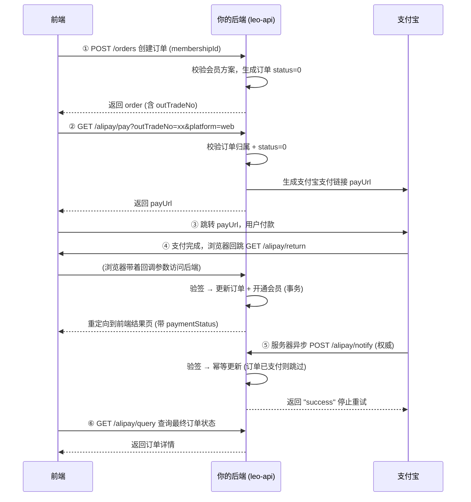

我先把当前支付链路的几个文件状态确认一遍，再给你完整捋一遍流程。

Read , lines 55 to 80

Read 

确认完毕，代码链路是完整的。我按“前端视角”给你完整捋一遍，一共 6 步。

---

## 逐步说明

### ① 创建订单 — `POST /orders`

前端提交 `{ membershipId, paymentMethod }` → `createMembershipOrder`

- 校验会员方案存在
- 生成 `outTradeNo`（唯一商户订单号）、`userId`、`membershipId`、`subject`、`totalAmount`
- `status = 0`（待支付）

### ② 生成支付链接 — `GET /alipay/pay`（需登录）

- 先调 `getOrderForPayment`：**防重复支付**的关键校验
  - 订单必须存在
  - 必须属于当前用户
  - `status` 必须是 `0`，否则 400 拒绝
- 拼 `bizContent`（订单号、金额、标题、同步回跳地址、异步通知地址）
- 按 `platform` 选支付方式：
  - `web` → 电脑网站支付 `alipay.trade.page.pay`
  - `mobile` → 手机网站支付 `alipay.trade.wap.pay`
- 返回 `payUrl`，前端 `window.location` 跳转

### ③ 用户在支付宝付款

这一步在支付宝那边完成，你的后端不参与。

### ④ 同步回跳 — `GET /alipay/return`（浏览器跳回）

支付宝把浏览器带回 `ALIPAY_RETURN_URL`（= 你的 `/alipay/return`），带上 `out_trade_no / trade_no / trade_status / total_amount`：

1. **验签**（`checkNotifySign`），失败直接 400
2. 调 `updateOrderPaymentStatus`：更新订单 `status=1` + `tradeNo` + `paidAt` + `paymentMethod=1`，并在**同一事务**里 `grantMembership`（改 `role`、叠加 `membershipExpiresAt`）
3. 重定向到 `FRONTEND_RETURN_URL`，把 `outTradeNo / tradeNo / tradeStatus / paymentStatus` 通过 query 带给前端结果页

> 注意：这一步是“给用户看结果”的，浏览器跳转会带登录态问题，所以它不挂鉴权，靠验签保证安全。

### ⑤ 异步通知 — `POST /alipay/notify`（服务器到服务器，**权威**）

支付宝服务器确认结果后主动 POST 过来（与浏览器无关，**不会丢**）：

1. 验签失败 → 返回 `failure`，支付宝会按策略持续重试
2. 调同一个 `updateOrderPaymentStatus` —— 因为订单已经是 `status=1`，**幂等直接跳过**，不会重复叠加会员时间
3. 返回 `"success"`，支付宝停止重试

### ⑥ 查询订单 — `GET /alipay/query` 或 `GET /orders/:outTradeNo`（需登录）

前端结果页可随时查订单最终状态，返回时已带 `membershipMonths` 和 `membership` 信息。

---

## 帮你理清 3 个容易乱的记忆点

| 概念      | 记忆口诀                                                   |
| --------- | ---------------------------------------------------------- |
| `/pay`    | 生成支付链接（需登录）                                     |
| `/return` | **同步**、**给用户看**、浏览器跳转、验签后更新+跳前端      |
| `/notify` | **异步**、**给系统用**、服务器直连、权威状态来源、重试机制 |

**为什么要有两个回调？**

- `/return` 可能丢（用户中途关页面/断网）
- `/notify` 保证最终一定补上，且幂等设计让两个回调先后到达也不会出错（先到先生效，后到直接跳过）

**`updateOrderPaymentStatus` 为什么是核心？**
两个回调都调它，它负责：金额校验 → 幂等判断 → 事务内「订单更新 + 会员开通」，一套逻辑两端复用。

---

流程本身已经闭环了。如果你想继续，我可以帮你加一个“前端结果页示例”或者把这段流程写进项目的 `README`/接口文档里，方便后面回顾。
