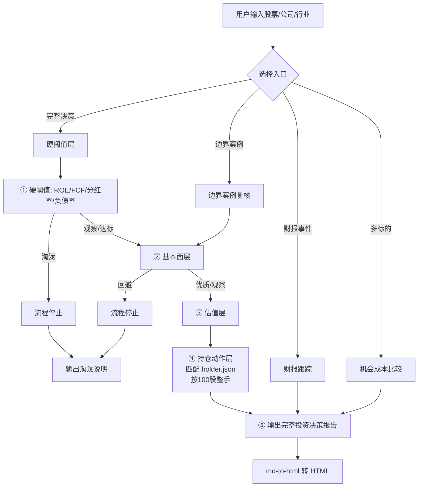

# 📊 A 股个人投资调研系统 · 分析总结

> 生成日期：2026-08-15
> 范围：`KnowledgeBase/stocks` 目录及其关联 Skill / Prompt / 脚本
> 一句话定位：**一套以"巴菲特 × 费雪 × 林奇 × 格雷厄姆 + 芒格 + 价值投资 3.0"为核心方法论、可重复执行的个人 A 股投研流水线，覆盖"筛选 → 研究 → 估值 → 持仓决策 → 财报跟踪 → 报告生成"全链路。**

---

## 一、系统定位与目标

这是一个**个人使用的 A 股长期价值投资决策系统**，不是量化回测平台，也不是短线交易工具。它的目标非常明确：

1. **筛选值得投资的公司**，而不是"分析很多公司"。
2. **回答"现在是否值得买入 / 加仓 / 持有 / 减仓 / 清仓"**，而不是停留在定性描述。
3. 以 **5-10 年长期视角** + **安全边际优先** + **风险优先（先想会亏多少）** 做决策。
4. 把投研过程**沉淀为可复用的方法论（Skill）+ 统一模板（Prompt）+ 历史报告库**，让每次调研不必从零开始。

---

## 二、核心投资方法论（灵魂）

### 2.1 四合一框架（主干）

| 思想家       | 负责维度          | 核心问题                                               |
| ------------ | ----------------- | ------------------------------------------------------ |
| **巴菲特**   | 商业质量 & 护城河 | 这是不是一门好生意？护城河是否可持续？                 |
| **费雪**     | 成长跑道 & 再投资 | 增长能不能持续？管理层能否把利润高回报再投资？         |
| **林奇**     | 分类 & PEG & 买点 | 公司属于哪一类？故事是否简单可验证？估值口径是否匹配？ |
| **格雷厄姆** | 估值 & 安全边际   | 内在价值多少？当前价格是否留足失败保护？               |

### 2.2 芒格式"硬约束"

- **反向思考**：先写"什么会让这个结论失效"。
- **激励分析**：先看"谁因什么被奖励"，再判断数据是否可信。
- **误判心理学**：显式防范确认偏误、从众、沉没成本、叙事成瘾。
- **机会成本**：没有明显优势时宁可等待，不为行动而行动。

### 2.3 价值投资 3.0 / GARP 扩展

- 允许为**高质量成长**支付合理价格，但拒绝极端透支。
- 成长类标的加 **PEG / GARP** 约束；周期股、困境反转、资产型机会用差异化口径。
- **MQVGS / 市场状态 / 情绪 / 组合优化 / 因子暴露**：只在公开数据充分时才启用，数据不足时明确写"数据不足"，**禁止输出伪精确分数**——这是系统刻意设置的"硬边界"，防止装腔作势的量化。

---

## 三、系统架构（分层视图）

```
┌─────────────────────────────────────────────────────────────┐
│  ① 方法论层（Prompt / Skill 定义"怎么想"）                    │
│    prompt.md · plan.md · garp.md · grow.md · analyze.md      │
│    skill.md · enhance3~6.md（历史演进稿）                    │
│    .github/skills/a-share-*-workflow/SKILL.md                │
│    .github/prompts/*.prompt.md（统一报告模板）               │
├─────────────────────────────────────────────────────────────┤
│  ② 流程层（三/五层决策流水线）                                │
│    硬阈值 → 基本面 → 估值 → 持仓动作 → 可选附加层             │
├─────────────────────────────────────────────────────────────┤
│  ③ 数据层（脚本自动拉取，避免手工抄数）                       │
│    stocks/StockHoldings/*_fetch_latest.py（akshare）          │
│    *_latest_refresh.json / *_latest_metrics.json             │
│    腾讯行情 / 东财 datacenter / 同花顺一致预期               │
├─────────────────────────────────────────────────────────────┤
│  ④ 决策事实层（用户自己的持仓事实源）                         │
│    stocks/my/holder.json（股票名称/代码/数量/成本）           │
├─────────────────────────────────────────────────────────────┤
│  ⑤ 产出层（报告库 + 行动日志）                                │
│    stocks/reports/*.md / *.html（完整报告 + 更新报告）        │
│    stocks/actionLogs/*.txt（持仓优化建议、动作排序）          │
│    .github/skills/md-to-html（md → 精美 HTML 报告生成器）    │
└─────────────────────────────────────────────────────────────┘
```

---

## 四、目录结构与职责

### 4.1 `stocks/` 顶层（方法论 Prompt 稿）

| 文件                | 角色                                              | 状态                 |
| ------------------- | ------------------------------------------------- | -------------------- |
| `prompt.md`         | 投资分析 Agent 主提示词 v2（四合一版）            | 现行                 |
| `plan.md`           | 投资分析 Agent 提示词（四合一导向）               | 现行                 |
| `skill.md`          | 高级分析能力参考（芒格要求 + 估值/风控/决策能力） | 现行                 |
| `garp.md`           | 自动调仓 Agent（四合一 GARP 版，三层决策）        | 现行                 |
| `grow.md`           | 四合一成长股分析 Agent                            | 现行                 |
| `analyze.md`        | 英文版四合一分析框架（10 分制）                   | 参考                 |
| `enhance3/4/5/6.md` | 历史增强稿（从 MQVGS 机构版到四合一硬边界演进）   | **历史存档，仅参考** |

### 4.2 `.github/skills/`（可复用 Skill）

| Skill                         | 用途                                                                                                 |
| ----------------------------- | ---------------------------------------------------------------------------------------------------- |
| `a-share-investment-workflow` | 主流程：硬阈值 → 基本面 → 估值 → 持仓动作 → 附加层，含完整分支规则（淘汰即停、观察可续、回避即停等） |
| `a-share-edge-case-workflow`  | 边界案例：硬阈值单项不过但基本面强时，判断是否允许继续研究（上限只到"观望"，买入留人工）             |
| `md-to-html`                  | 把研究报告 md 转成精美单文件 HTML（内联样式、TOC、图表、重点高亮）                                   |

### 4.3 `.github/prompts/`（统一报告模板）

- `a-share-full-investment-report.prompt.md`（完整决策总报告）
- `a-share-threshold-report.prompt.md`（硬阈值报告）
- `a-share-fundamental-report.prompt.md`（基本面报告）
- `a-share-valuation-report.prompt.md`（估值报告）
- `a-share-opportunity-cost-report.prompt.md`（机会成本比较）
- `a-share-earnings-event-report.prompt.md`（财报事件跟踪）
- `a-share-edge-case-report.prompt.md`（边界案例）
- `stock-holdings-batch-import.prompt.md` / `stock-holdings-monthly-review.prompt.md`

### 4.4 `stocks/StockHoldings/`（数据抓取脚本）

- **可复用脚本**：`cmcc_fetch_latest.py`（中国移动）、`hik_fetch_latest.py`（海康威视）、`mt_fetch_latest.py`（贵州茅台）、`import_holdings_batch.py`
- **历史一次性脚本**：`tmp_*.py`（各家财报临时抓取）
- **数据产物**：`*_latest_refresh.json`（原始）、`*_latest_metrics.json`（精简指标）、各公司指标/研报摘要 JSON、历史年报 PDF

### 4.5 `stocks/my/holder.json`

当前持仓事实源，字段：`股票名称 / 股票代码 / 持仓数量 / 买入成本`。所有报告默认读取它做持仓匹配（按字符串处理代码，避免前导零丢失）。

### 4.6 `stocks/reports/`（报告库）

- **完整投资决策报告** ×58（md）：覆盖 40+ 只标的
- **HTML 报告** ×3（中国移动 / 海康威视 / 贵州茅台，最新一期）
- **更新/跟踪报告** ×5：财报事件后的假设更新（如德业股份、分众传媒、瑞芯微等）
- 命名规则：`YYYY-MM-DD-公司名-报告类型`

### 4.7 `stocks/actionLogs/`（行动日志）

持仓优化建议、加仓顺序、动作排序等（如 `20260429-结合年报的持仓优化建议.txt`）。

---

## 五、完整工作流（从需求到产出）



### 每层输出标签（强制）

- **硬阈值层**：达标 / 观察 / 淘汰 / 不适用
- **基本面层**：优质 / 观察 / 回避
- **估值层**：买入 / 观望 / 放弃
- **持仓动作层**：继续持有 / 加仓 / 不加仓 / 减仓 / 清仓 / 只保留观察仓 / 等待

### 关键决策规则（防伪防错）

1. 硬阈值淘汰 → 默认停流程，除非用户要求边界复核。
2. 基本面回避 → 估值只能作补充，不能因便宜反转成买入。
3. **只有基本面成立 + 安全边际足够，才允许"买入"**。
4. 安全边际不足时，必须给出**等待条件**，不能只说"继续关注"。
5. A 股动作一律 **100 股整数倍**，资金不足一手写"等待/不操作"。
6. 数据缺失必须写"数据不足"，**不编造成本、股数或盈亏**。

---

## 六、数据与工具链

| 环节        | 工具 / 数据源                                | 说明                                  |
| ----------- | -------------------------------------------- | ------------------------------------- |
| 财报数据    | **akshare**（`stock_financial_abstract` 等） | 自动识别最新报告期，算 YoY            |
| 分红        | akshare `stock_fhps_detail_em`               | 按年度汇总 DPS，算 TTM 股息率         |
| 股价        | 东财实时 → 腾讯行情回退                      | 多层兜底，避免抓取失败                |
| 一致预期    | 同花顺盈利预测                               | 2026E/2027E EPS 均值与区间            |
| 资产负债表  | 东财 datacenter                              | 合同负债、存货、应收等                |
| 主营构成    | 东财 `stock_zygc_em`                         | 分产品/分地区拆分                     |
| 新闻旁证    | 东财新闻聚合                                 | Scuttlebutt 式公开信息交叉验证        |
| 报告生成    | `md-to-html` skill                           | md → 单文件精美 HTML（TOC/图表/高亮） |
| Python 环境 | `/tmp/ak-env`（Python 3.9 venv）             | 复用 akshare 依赖                     |

---

## 七、演进历史（为什么长这样）

系统经历了明显的"**从大而全到克制**"的演进：

1. **enhance6 / v8 机构版**（早期构想）：宣称完整支持 MQVGS 多因子打分、新闻情绪 NLP、市场状态、Markowitz 组合优化、因子暴露——野心很大但数据常不充分。
2. **enhance3/4/5 中间稿**：开始收敛，明确"MQVGS 等仅作辅助"。
3. **现行官方实现**（skill.md + a-share-investment-workflow）：
   - 保留四合一框架主干；
   - **对量化扩展设硬边界**：数据不充分时禁止输出伪精确分数；
   - 用 **Prompt 模板 + Skill 工作流** 把方法固化，可重复执行；
   - 新增**财报事件跟踪**、**机会成本比较**等增量场景。

**设计哲学**：宁可拒绝输出伪精确的量化字段，也不编造"看起来专业"的数字；一切结论必须能追溯到公开信息或前序阶段结果。

---

## 八、当前持仓概览（holder.json 快照）

| 标的     | 代码   | 数量 | 成本（元） |
| -------- | ------ | ---- | ---------- |
| 中际联合 | 605305 | 600  | 43.84      |
| 中国海油 | 600938 | 400  | 31.95      |
| 中国移动 | 600941 | 400  | 94.12      |
| 分众传媒 | 002027 | 2400 | 6.73       |
| 德业股份 | 605117 | 1400 | 52.56      |
| 恩华药业 | 002262 | 1000 | 25.89      |
| 招商银行 | 600036 | 1500 | 38.51      |
| 格力电器 | 000651 | 600  | 40.76      |
| 比亚迪   | 002594 | 500  | 101.17     |
| 海大集团 | 002311 | 600  | 54.61      |
| 海康威视 | 002415 | 1200 | 30.00      |
| 珀莱雅   | 603605 | 1000 | 63.69      |
| 福耀玻璃 | 600660 | 1200 | 57.95      |
| …        |        |      |            |

> 具体以 `stocks/my/holder.json` 为准；报告中的持仓动作层会按该表匹配计算盈亏并给操作建议。

---

## 九、系统优点与局限

### ✅ 优点

- **方法一致可复用**：三层流水线 + 固定标签 + 分支规则，降低主观漂移。
- **防伪精确**：拒绝编造量化分数，数据不足明确标注。
- **贴近个人投资实操**：绑定真实持仓、按 100 股整手、给触发价格与等待条件。
- **产出物化**：报告库 + 行动日志 + HTML 可视化，历史可追溯、可对比。
- **数据自动化**：akshare 脚本一键拉取最新财报，避免手工抄数错误。

### ⚠️ 局限 / 可改进

- **数据源依赖第三方聚合**（akshare / 东财 / 腾讯），个别接口偶发失败或字段口径漂移（如前缀 SH/SZ、指标名变化），需多层回退。
- **财报原文 PDF 抓取不稳定**（如海康中报曾 500），分部/海外口径有时只能依赖研报转述。
- **一致预期更新滞后**：机构下修全年 EPS 后，报告的估值锚点需人工复核。
- **港股/美股标的**部分硬阈值（如 ROE 门槛）需差异化口径，当前主流程偏 A 股。
- **enhance 系列历史稿与现行稿并存**，易混淆，建议在文档头标注"历史存档"（现行稿已这样做）。

---

## 十、一句话总结

这套系统把"四合一价值投资"从口头理念落地成了一套**可重复、可追溯、防伪精确、贴合真实持仓**的投研流水线：先用硬阈值粗筛、再用基本面与估值精判、最后结合持仓给出一手一手的可执行动作，并用统一模板 + 精美 HTML 把每次判断沉淀成报告库，让"为什么买/为什么不买"始终有据可查。
